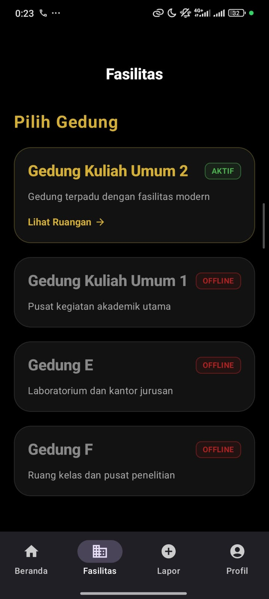
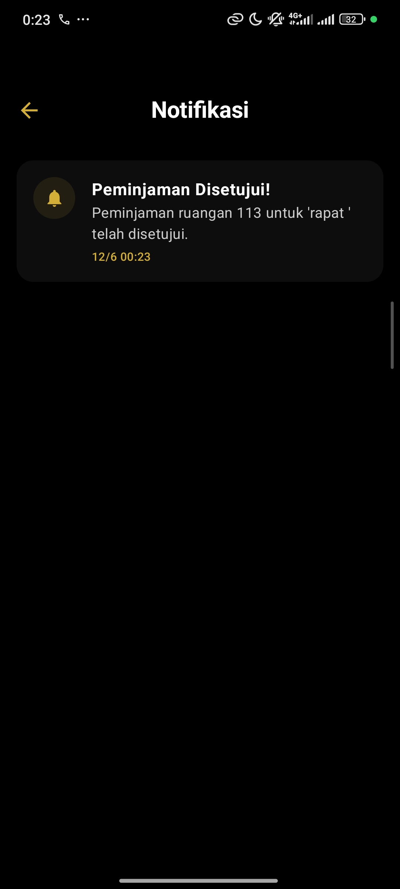
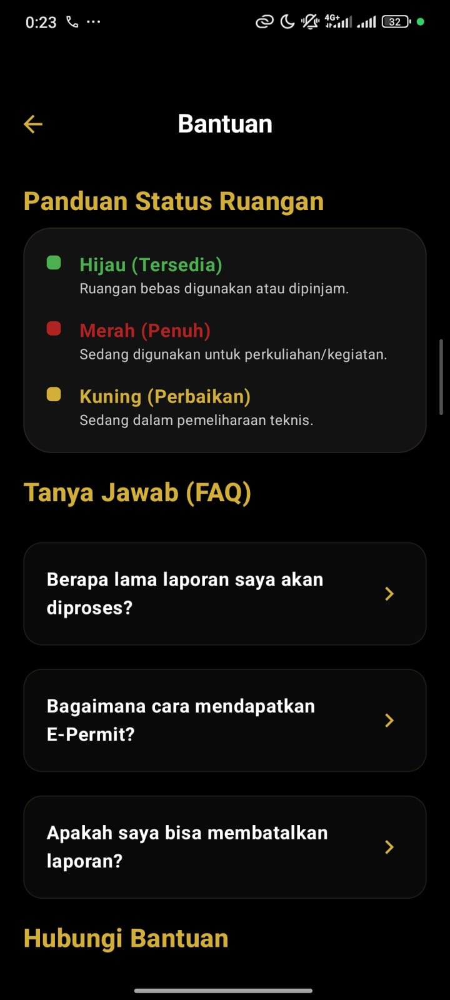
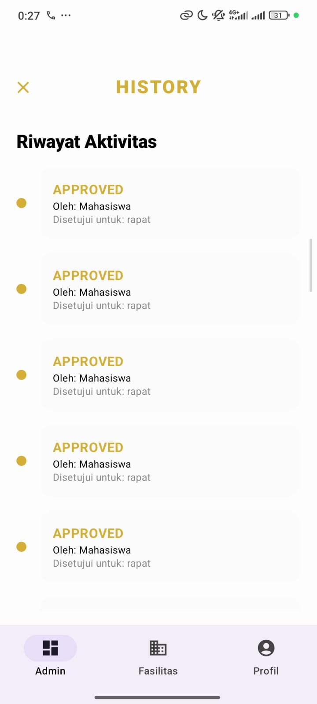
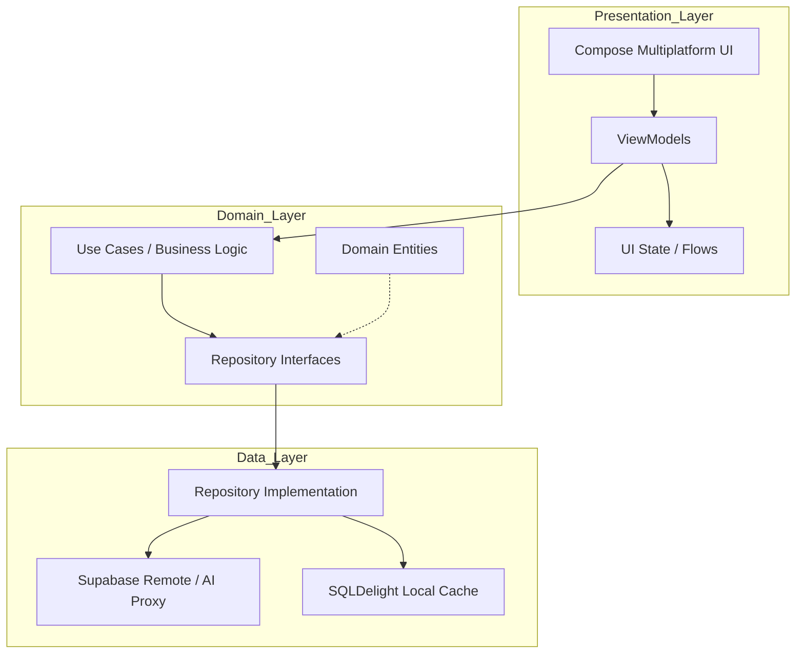

# 🌌 Roomie - Solusi Satu Pintu Fasilitas Kampus

**Roomie** adalah platform manajemen fasilitas terintegrasi yang didesain untuk menyederhanakan birokrasi kampus. Proyek ini menggabungkan sistem **Persetujuan Peminjaman (Approval System)**, **E-Permit Digital**, dan **Pelaporan Fasilitas** dalam satu ekosistem digital yang modern, transparan, dan efisien.

Aplikasi ini dibangun menggunakan **Kotlin Multiplatform (KMP)** dan **Compose Multiplatform**, menargetkan platform Android dan iOS dari satu codebase tunggal dengan arsitektur yang sangat terukur.

---

## 🎬 Demo & Release

|                                           📺 Video Demo (YouTube)                                            | 📦 Download Release APK |
|:------------------------------------------------------------------------------------------------------------:| :---: |
|                        [Video Demo](https://youtu.be/Rg8yU2-wA2U?si=tAWTuWHw1x9WR1Rp)                        | [**Download Roomie v1.0.0**](https://drive.google.com/file/d/1_bYvw1E3ATRCLZ8p97we0jlfcCL6ZR8q/view?usp=sharing) |


## 📸 Visual Showcase

### 📱 Perspektif Mahasiswa

| Dashboard Utama | Penjelajah Fasilitas | Detail Pencarian |
| :---: | :---: | :---: |
|  |  |  |

| Roomie AI Assistant | Form Peminjaman | Status Jadwal |
| :---: | :---: | :---: |
|  |  |  |

| Pelaporan Fasilitas | Notifikasi Reaktif | Manajemen Profil |
| :---: | :---: | :---: |
|  |  |  |

| Bantuan & Support | Detail Jadwal | Informasi Ruangan |
| :---: | :---: | :---: |
|  |  |  |

| Jadwal Penggunaan | Riwayat Fasilitas | Detail Maintenance |
| :---: | :---: | :---: |
|  |  |  |

| Status: Booked | Status: Available | Status: Maintenance |
| :---: | :---: | :---: |
|  |  |  |

### 🛠️ Perspektif Admin (Control Tower)

| Command Center Hub | Gauges Interaktif | Dashboard Lanjutan |
| :---: | :---: | :---: |
|  |  |  |

| Kontrol Fasilitas | Laporan Masuk | Detail Laporan |
| :---: | :---: | :---: |
|  |  |  |

| Validasi Laporan | Profil Admin | Bukti Kerusakan |
| :---: | :---: | :---: |
|  |  |  |

### 📅 Detail Ketersediaan Jadwal (Per Lantai)

| Lantai 1 | Lantai 2 | Lantai 3 | Lantai 4 |
| :---: | :---: | :---: | :---: |
|  |  |  |  |

---

## 🏗️ Arsitektur Aplikasi (Clean Architecture)

Aplikasi ini menggunakan standar **Clean Architecture** dengan pemisahan tanggung jawab yang sangat ketat untuk memastikan skalabilitas dan kemudahan pengujian.



### 📂 Struktur Proyek Terperinci
```text
composeApp/src/commonMain/kotlin/com/example/Roomie/
│
├── core/               # Network Monitor, Database Factory, & Security Utils
├── data/               # RepositoryImpl, Supabase Service, & SQLDelight
│   ├── remote/         # AI Service (Gemini) & Supabase Cloud Logic
│   └── local/          # DataStore & SQLDelight Schema
├── domain/             # Entities, Repository Contracts, & UseCases
├── di/                 # Koin Modules (Dependency Injection)
├── presentation/       # UI Layer (Material 3)
│   ├── auth/           # Login & Session Management
│   ├── admin/          # Control Center & Approval System
│   ├── facility/       # Booking & Smart Search
│   ├── assistant/      # Gemini AI Chat Interface
│   └── report/         # Cloud Reporting System
└── util/               # AppStrings & Date Formatters
```

---

## 🚀 Fitur Utama

### 1. 🔐 Role-Based Access Control (RBAC) & Cloud Auth
- **Dual Perspective:** Alur kerja dinamis untuk **Mahasiswa** (Lapor & Cari) dan **Admin** (Approval & Kontrol).
- **Secure Cloud Auth:** Autentikasi terpusat menggunakan **Supabase Auth** dengan sistem *Shadow Email* untuk keamanan NIM/NIP. **Auto-SignUp** diaktifkan untuk kemudahan akses perangkat baru.
- **Persistent Profile:** Manajemen session menggunakan **DataStore** yang menyimpan data profil dan identitas user secara aman.

### 2. 🏢 Smart Facility Explorer & Advanced Search
- **Date-Aware Status:** Status ruangan (Tersedia/Penuh) bersifat dinamis mengikuti kalender. Ruangan bisa terlihat penuh di tanggal 21, tapi tersedia di tanggal 22.
- **Capacity Filtering:** Pencarian ruangan cerdas berdasarkan kapasitas kursi (Range 35 - 60 kursi) menggunakan **Dropdown Filter**.
- **Real-time Multi-Device Sync:** Perubahan status ruangan di satu HP (misal: di-book oleh Mulya) akan langsung terlihat di HP lain (Nahli) secara instan via **Supabase Realtime**.

### 3. 📝 Integrity-Driven Booking Workflow
- **Multi-Room Selection:** Kemampuan memilih beberapa ruangan sekaligus (e.g. Ruang 101 & 102) dalam satu pengajuan peminjaman.
- **NTP Server Time Sync:** Pencegahan manipulasi waktu lokal menggunakan sinkronisasi jam server pusat (NTP) untuk validasi peminjaman.
- **Automatic Status Janitor:** Sistem otomatis mengubah status peminjaman menjadi "COMPLETED" dan membebaskan ruangan jika waktu sewa telah usai.

### 4. 📸 Cloud Reporting & Dynamic Profile
- **Avatar Management:** Fitur ganti foto profil langsung dari galeri yang diunggah ke **Supabase Storage** dan muncul secara sinkron di Header Beranda.
- **Image Evidence:** Pelaporan kerusakan fasilitas dilengkapi dengan lampiran foto bukti menggunakan **Peekaboo Image Picker**.
- **Admin Evidence Viewer:** Admin dapat memvalidasi laporan langsung melalui pratinjau gambar yang ditarik dari Cloud.

### 5. 🤖 Roomie AI Assistant (Gemini 2.5 Flash)
- **Natural Language Query:** User dapat mencari ruangan cukup dengan mengetik "Cari ruang GKU 2 kapasitas 40 buat besok jam 8 pagi".
- **Intent Extraction:** AI secara otomatis mengekstrak data Gedung, Kapasitas, dan Waktu dari bahasa manusia untuk mem-filter database secara akurat.

---

## 🧪 Kualitas Kode & Pengetesan

Aplikasi ini menjaga kualitas kode melalui pengujian otomatis yang komprehensif:

### 1. Unit Testing (71 Tests)
Kami menguji logika bisnis pada lapisan Repository, UseCase dan ViewModel untuk memastikan keandalan sistem.
- **Total Test:** 71 Unit Tests (Passed ✅)
- **Hasil Coverage:** 
  <p align="left">
    
  </p>

### 2. UI Testing
Pengujian antarmuka untuk memastikan alur kritis pengguna berjalan dengan baik pada perangkat Android.
- **Cakupan:** Login Flow, Navigation, AI Assistant Trigger.
- **Cara Menjalankan:**
  ```bash
  ./gradlew connectedAndroidTest
  ```

### 3. Static Analysis
Menggunakan **Detekt** untuk menjaga standar penulisan kode Kotlin.
- **Cara Menjalankan:**
  ```bash
  ./gradlew detekt
  ```

---

## 📅 Project Roadmap (Sprint 1 - 5)

| Sprint | Fokus Utama | Ringkasan Milestone | Status |
|---|---|---|---|
| **Sprint 1** | Infrastructure | Repository Setup, Koin DI, SQLDelight, GitHub Actions CI/CD | ✅ Done |
| **Sprint 2** | Core Features | Login RBAC, Multi-Select Grid, Booking Logic, Supabase Cloud Storage | ✅ Done |
| **Sprint 3** | Advanced Logic | Offline-First, Real-time Sync, NTP Time, Command Center UI | ✅ Done |
| **Sprint 4** | Quality Control | 70+ Unit Tests, UI Testing, Code Coverage >70%, UI Polish | ✅ Done |
| **Sprint 5** | Final Delivery | Signed APK Generation, Demo Scripting, Backup Plan, UAS Demo Day Prep | ✅ Done |

---

## 📑 Detail Progress Pengembangan (Sprint 1 - 5)

| Sprint | Kriteria | Status | Detail / Bukti Implementasi |
|:---:|---|:---:|---|
| **1** | GitHub Collaboration | ✅ | Tim (Mulya & Nahli) terdaftar sebagai kolaborator dengan riwayat commit aktif. |
| | KMP Project Structure | ✅ | Struktur folder mengikuti *Clean Architecture*: core, data, domain, presentation, di. |
| | GitHub Actions CI | ✅ | Pipeline CI otomatis aktif untuk validasi Build & Unit Testing (11 tests passed). |
| | Comprehensive README | ✅ | Dokumentasi lengkap mencakup tim, deskripsi fitur, tech stack, dan arsitektur. |
| | Project Plan & Tasks | ✅ | Roadmap terukur per sprint dengan pembagian tugas (Logic vs UI). |
| | Koin DI Setup | ✅ | Dependency Injection modular terbagi dalam AppModule, Data, Domain, & ViewModel. |
| **2** | Minimal 3 Screens | ✅ | Tersedia >10 layar fungsional: Home, Detail, Booking, Report, Admin, Search, dll. |
| | Navigasi & Argumen | ✅ | Navigasi dinamis dengan passing data (e.g. roomId, date, listRoomIds). |
| | Repository Pattern | ✅ | Abstraksi data layer menggunakan interface domain dan implementasi Supabase. |
| | Local & Cloud Storage | ✅ | Sinkronisasi SQLDelight (Local v5), DataStore (Prefs), & Supabase (Cloud Database). |
| | CRUD Operations | ✅ | Operasi Create, Read, Update, Delete fungsional dan tersinkron ke Cloud. |
| | UI States (L/S/E) | ✅ | Penanganan state reaktif (Loading, Success, Error) di seluruh layar utama. |
| | App Accessibility | ✅ | Alur navigasi tertutup (no dead ends), user dapat menjelajah seluruh fitur app. |
| | API Integration | ✅ | Integrasi Supabase SDK (DB/Auth/Realtime) & Ktor Client (Server Time Sync). |
| **3** | Search/Filter | ✅ | Implementasi filter kapasitas cerdas & pencarian reaktif di sisi Mahasiswa & Admin. |
| | Offline-First Support | ✅ | Arsitektur data hibrida (Local SQLite via SQLDelight + Remote Supabase Sync). |
| | Additional Screens | ✅ | Hub Dashboard Admin, Layar Notifikasi, dan Manajemen Profil User. |
| | Bonus Feature | ✅ | Integrasi Peekaboo Image Picker & NTP Anti-Fraud System Time Synchronization. |
| | Extra Feature | ✅ | Interactive Command Center (Gauges interaktif) & Seamless Real-time WebSocket. |
| | Regression Test | ✅ | Validasi seluruh fitur utama Sprint 2 tetap stabil (11 Unit Tests PASSED). |
| **4** | Logic Stability | ✅ | Perbaikan kritis pada Cloud Sync dan alur login Auto-SignUp untuk cross-device. |
| | AI Integration | ✅ | Stabilisasi Roomie AI Assistant menggunakan Gemini 2.5 Flash via Ktor Proxy. |
| | Massive Testing | ✅ | Implementasi **71 Unit Tests** mencakup Repository, UseCase, dan ViewModels. |
| | UI Interaction Test| ✅ | Implementasi Automated UI Test untuk alur Login dan Navigasi Utama. |
| | High Coverage | ✅ | Mencapai **>70% Line Coverage** pada komponen logic utama aplikasi. |
| | UI/UX Polish | ✅ | Refinement Admin "Control Tower" Dashboard dan perbaikan Keyboard Overlap. |
| **5** | Final Delivery | ✅ | App running on device, Demo Video ready, and Architecture Diagram finalized. |

---

## 👥 Tim Pengembang (Kelompok Tubes)

Aplikasi ini dikembangkan oleh:
1. **Mulya Delani** - 123140019 (Lead Developer / Logic Architect)
2. **Nahli Saud Ramdani** - 123140049 (UI Designer / Cloud Specialist)

---

> **"Roomie: Pinjem ruang gampang, lapor fasilitas cepat."**
